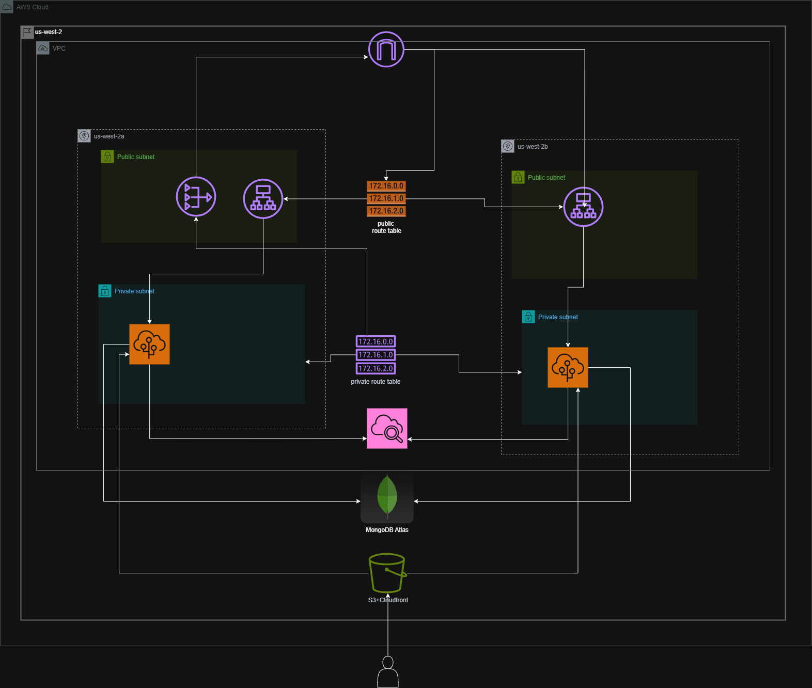

# Deploying Three-Tier Architecture on AWS Elastic Beanstalk (Terraform)

This project demonstrates the deployment of a **three-tier web application** on **AWS Elastic Beanstalk** using **Terraform as Infrastructure as Code (IaC)**.  
The architecture follows AWS best practices and includes application deployment, environment configuration, monitoring, and scalability.

---

## Architecture Overview



### Architecture Breakdown
- **Presentation Layer**
  - Client access via browser
  - Application served through Elastic Beanstalk endpoint
- **Application Layer**
  - Node.js backend application
  - Deployed on AWS Elastic Beanstalk (EC2 managed platform)
- **Data Layer**
  - MongoDB (external managed database service)
- **Supporting AWS Services**
  - IAM for roles and permissions
  - CloudWatch for monitoring and logs

---

## Project Objectives

- Deploy a Node.js application using Elastic Beanstalk
- Automate infrastructure provisioning using Terraform
- Configure environment variables and IAM roles securely
- Enable monitoring and health checks
- Demonstrate a production-style three-tier architecture

---

## Technologies Used

- **AWS Elastic Beanstalk**
- **Terraform**
- **Node.js**
- **MongoDB**
- **AWS IAM**
- **Amazon CloudWatch**
- **GitHub**


## Repository Structure

```text
.
├── backend/
│   ├── controllers/
│   ├── routes/
│   ├── models/
│   ├── middleware/
│   ├── utils/
│   ├── app.js
│   └── package.json
├── TASK9.png
├── TASK9.pdf
├── README.md
```

---

## Key Learnings

* Practical use of **Terraform with Elastic Beanstalk**
* Real-world **three-tier architecture deployment**
* Importance of IAM roles and environment variables
* Monitoring and health management in AWS

---

## Conclusion

This project successfully demonstrates a **production-style three-tier architecture** deployed on AWS using **Elastic Beanstalk and Terraform**.
It highlights automation, scalability, and monitoring while following cloud best practices and serves as a strong portfolio project for DevOps and Cloud Engineering roles.

---

## Author

**Sardar Noor Ul Hassan**
DevOps / Cloud Engineer
